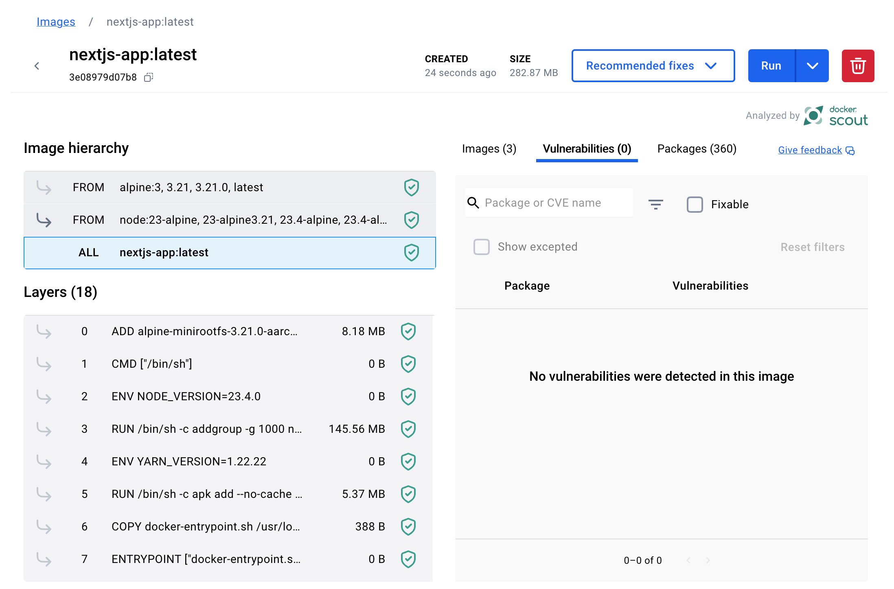

<div align="center">
  
</div>

This repository contains the configuration for running a Next.js 15 application using Docker. It supports development, production, and static export modes with three different Dockerfiles and a docker-compose.yml file.

## More about me

- [Blogs on Medium](https://medium.com/@kristiyanvelkov)
- [LinkedIn](https://www.linkedin.com/in/kristiyan-velkov-763130b3/)

---

## Security

This Docker image has been thoroughly scanned for vulnerabilities to ensure a secure environment for your Next.js 15 application. The image has passed all vulnerability assessments using Docker's built-in security tools, including Docker Scout. Regular updates to the base image and dependencies are recommended to maintain a high level of security.

<div align="center">
  
</div>

- **Article**: [Docker Scout in Action](https://levelup.gitconnected.com/docker-scout-in-action-63e7c812532a?sk=120903755538c5065585d458d5e1eaa8)

---

## Prerequisites

- Docker installed on your machine.
- Make installed to use the Makefile commands.

---

## Usage

| Command                | Description                          |
| ---------------------- | ------------------------------------ |
| `make help`            | Show available commands.             |
| `make build`           | Build the Docker image.              |
| `make run`             | Run the Docker container.            |
| `make build-run`       | Build and run the Docker container.  |
| `make stop`            | Stop the Docker container.           |
| `make restart`         | Restart the Docker container.        |
| `make logs`            | Show logs from the Docker container. |
| `make clean`           | Remove Docker image and container.   |
| `make clean-container` | Remove only the Docker container.    |
| `make clean-image`     | Remove only the Docker image.        |

---

### Environment Variables

The following variables are defined in the `Makefile` and can be customized if needed:

- `IMAGE_NAME`: The name of the Docker image. Default is `nextjs-app`.
- `CONTAINER_NAME`: The name of the Docker container. Default is `nextjs-container`.
- `HOST_PORT`: The port on the host machine that the container will map to. Default is `3000`.
- `CONTAINER_PORT`: The port inside the Docker container where Nginx serves the application. Default is `80`. For dev use `3000`
- `DOCKERFILE`: The Dockerfile to use. Default is `Dockerfile`. If you want to use standalone version of the build use Dockerfile.standalone -`NODE_VERSION`: The version of Node.js used in the base image. Default is `22.14.0-alpine`. This can be updated for easier migrations to newer versions.
- `NGINX_VERSION`: The version of Nginx used in the export configuration. Default is `1.27.4-alpine`. This can be customized to match specific requirements or upgraded when necessary.

---

### Next.js Configuration

To configure the next.config.js file for different output options, use the following setup:

```typescript
import type { NextConfig } from "next";

const nextConfig: NextConfig = {
  // output: "standalone", // Use the Dockerfile.standalone file with this option
  output: "export",
};

export default nextConfig;
```

- **Standalone Mode**: Uncomment the line output: "standalone" if you want to use Dockerfile.standalone.
- **Export Mode**: By default, this configuration uses output: "export", which enables static export of the Next.js app.

---

### How to Build and run the project under Docker

1. **Build the Docker Image**:

```bash
  make build
```

2.  **Run the Docker Container**:

```bash
  make run
```

3. **Build and Run with a Single Command**
   Alternatively, you can build and run in one step with:

```bash
 make build-run
```

---

## Deployment

This configuration is designed for deployment on environments where Docker is available. The Nginx server efficiently serves the static Next.js build, making it suitable for production use.

---

## Notes

- Ensure Docker is properly configured to allow external access to port `3000` on the host machine if necessary.
- Modify the Makefile variables as needed for custom image names, container names, and ports.

---

## Docker Compose with Watch Mode

This project supports watch mode for live reloading during development using Docker Compose. The docker-compose.yml file is configured to sync changes in your local project directory with the container and rebuild the service when key files change.

```bash
docker compose up --watch
```

**Watch Mode Configuration: The develop section in the docker-compose.yml file includes:**

- **Sync Changes**: Automatically syncs changes made in your local ./app directory with the /app directory inside the container. -**Rebuild Dependencies**: Automatically rebuilds the service when package.json changes, e.g., when you install a new package.
- **File Syncing**: Changes to source files will be reflected inside the container in real-time. However, the node_modules folder is excluded to improve performance.
